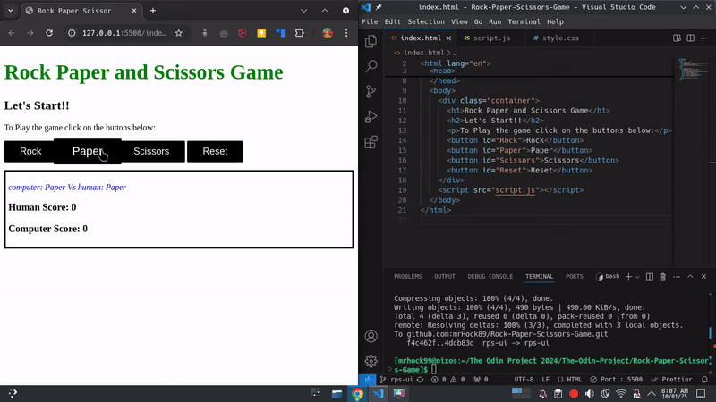
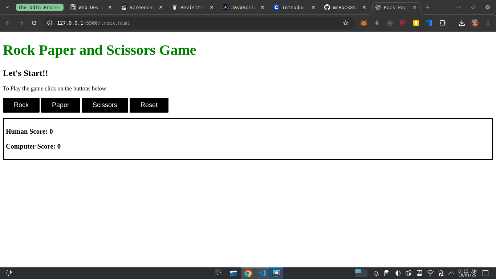
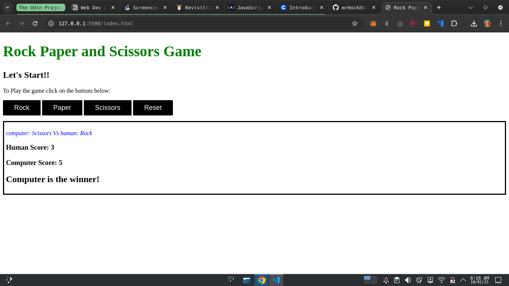

# Rock-Paper-Scissors-Game

This is the project to create Rock Paper Scissors game.

- Step 1: Created a function for computer's choice.

```JavaScript
// for computer choice
function getComputerChoice() {
  const min = 0;
  const max = 3;
  number = Math.floor(Math.random() * (max - min) + min);
  if (number === 1) {
    return "Rock";
  } else if (number === 2) {
    return "Paper";
  } else {
    return "Scissors";
  }
}
```

- Step 2: Create a function for user's to choice.

```JavaScript
// Human Choice
function getHumanChoice() {
  const number = prompt("Enter 1. Rock 2. Paper and 3. Scissors");
  if (number == 1) {
    return "Rock";
  } else if (number == 2) {
    return "Paper";
  } else {
    return "Scissors";
  }
}
```

- Step 3: Created two variable to track their Score

```JavaScript
const humanScore = 0;
const computerScore = 0;
```

- Step 4: Function to play a single game

```JavaScript
function playRound(computerChoosed, humanChoosed) {
  if (computerChoosed == humanChoosed) {
    // humanScore = humanScore;
    // computerScore = computerScore;
    return `Both choosed same.`;
  } else if (computerChoosed == "Rock" && humanChoosed == "Scissors") {
    return `${computerChoosed} beats ${humanChoosed}.`;
  } else if (computerChoosed == "Scissors" && humanChoosed == "Paper") {
    return `${computerChoosed} beats ${humanChoosed}.`;
  } else if (computerChoosed == "Paper" && humanChoosed == "Rock") {
    return `${computerChoosed} beats ${humanChoosed}.`;
  } else if (humanChoosed == "Rock" && computerChoosed == "Scissors") {
    return `${humanChoosed} beats ${computerChoosed}.`;
  } else if (humanChoosed == "Scissors" && computerChoosed == "Paper") {
    return `${humanChoosed} beats ${computerChoosed}.`;
  } else if (humanChoosed == "Paper" && computerChoosed == "Rock") {
    return `${humanChoosed} beats ${computerChoosed}.`;
  } else return `Wrong Choice.`;
}
const computerChoosed = getComputerChoice();
const humanChoosed = getHumanChoice();
console.log(computerChoosed, humanChoosed);
console.log(playRound(computerChoosed, humanChoosed));
```

- Step 5: Completed the playGame function

```JavaScript
function playRound(computerChoosed, humanChoosed) {
  if (computerChoosed == humanChoosed) {
    humanScore = humanScore;
    computerScore = computerScore;
  } else if (computerChoosed == "Rock" && humanChoosed == "Scissors") {
    computerScore++;
  } else if (computerChoosed == "Scissors" && humanChoosed == "Paper") {
    computerScore++;
  } else if (computerChoosed == "Paper" && humanChoosed == "Rock") {
    computerScore++;
  } else if (humanChoosed == "Rock" && computerChoosed == "Scissors") {
    humanScore++;
  } else if (humanChoosed == "Scissors" && computerChoosed == "Paper") {
    humanScore++;
  } else if (humanChoosed == "Paper" && computerChoosed == "Rock") {
    humanScore++;
  }
  console.log(computerScore, humanScore);
}
function playGame() {
  for (let i = 0; i < 5; i++) {
    playRound(getComputerChoice(), getHumanChoice());
  }
}

playGame();

if (computerScore > humanScore) {
  console.log("Computer wins.");
} else if (humanScore > computerScore) {
  console.log("Human Wins.");
} else {
  console.log("Tie.");
}
```

# Preview



# SCREENSHOTS



